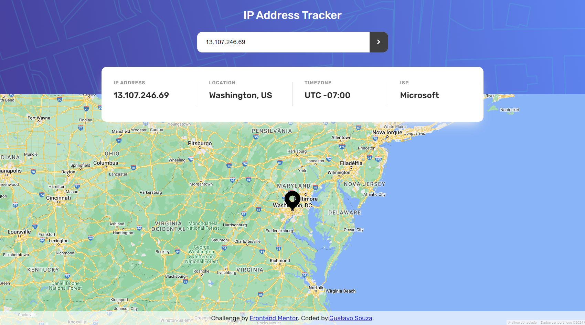
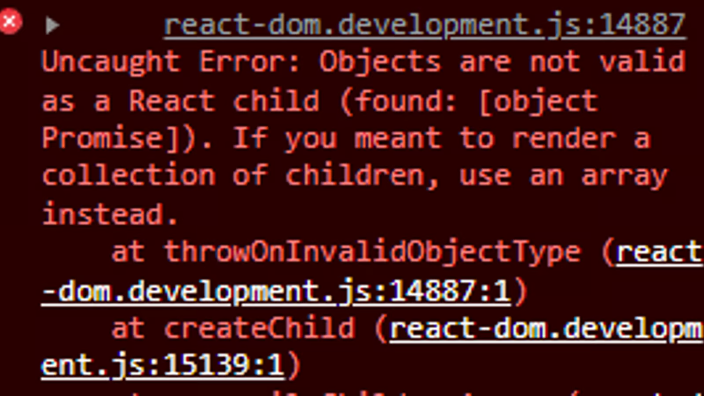

# IP Address Tracker

This is a Frontent Mentor challenge. See a demo on [my portfolio website](https://gustavo-souza.com/).

Frontend Mentor challenge: [IP address tracker](https://www.frontendmentor.io/challenges/ip-address-tracker-I8-0yYAH0).

Frontend Mentor challenges help you improve your coding skills by building realistic projects. 

# Frontend Mentor - IP address tracker solution

This is a solution to the [IP address tracker challenge on Frontend Mentor](https://www.frontendmentor.io/challenges/ip-address-tracker-I8-0yYAH0). Frontend Mentor challenges help you improve your coding skills by building realistic projects. 

## Table of contents

- [Overview](#overview)
  - [The challenge](#the-challenge)
  - [Screenshot](#screenshot)
  - [Links](#links)
- [My process](#my-process)
  - [Built with](#built-with)
  - [What I learned](#what-i-learned)
  - [Continued development](#continued-development)
  - [Useful resources](#useful-resources)
- [Author](#author)

## Overview

### The challenge

Users should be able to:

- View the optimal layout for each page depending on their device's screen size
- See hover states for all interactive elements on the page
- See their own IP address on the map on the initial page load
- Search for any IP addresses or domains and see the key information and location

### Screenshot



### Links

- Solution URL: [Add solution URL here](https://your-solution-url.com)
- Live Site URL: [IP Address Tracker](https://gustavosouza123.github.io/ip-address-tracker/)

## My process

### Built with

- [React](https://reactjs.org/) - JS library
- [Vite](https://vitejs.dev/) - frontend tooling
- Flexbox
- Responsiveness
- [Github Pages](https://pages.github.com/)

### What I learned

This is the first React app I made totally by myself.

The things I found most challenging were specifically related to how React works. I could implement these things in vanilla Javascript, for example.

For example. One thing I wanted to do was pass an object (from an API request) as a prop to another component to display its values on the child component. But when I did this I came accross the following error:



After some research up I found that React doesn't know what to render when provided with an object. So I have to use the data from the object in order to decide how to create the component to display. So the code ended up like this:

```jsx
// passing the prop to the child component on Tracker.jsx
return (
    <IpAddressInfo info={data != '' && {
        ip: data.ip,
        country: data.location.country,
        region: data.location.region,
        timezone: data.location.timezone,
        isp: data.isp,
    }} />
);
```

```jsx
// on the child component (IpAddressInfo.jsx)
const ip = info.ip || '-';
return (
    <div className="ip-address">
        <div className="title">IP Address</div>
        <div className="data">
            <p title={ip}>{ip}</p>
        </div>
    </div>
);
```

Another thing I'd like to highlight was that when passing the object as a prop, I first checked if the `data` variable (which is a state variable that holds the data returned from the API request) was not empty, or in other words, the request had been made to the API and was successful.

I did this because I was getting another error when passing the object without making the request, which makes sense if you think about it.

### Continued development

In the next React apps I build I want to continue refining my skills with the React library and getting used to some aspects of the library, since the thinking process when coding has to be different that when coding with vanilla Javascript or another framework.

Specifically, I want to continue getting used to how React manages state (which I find interesting but I found that many people don't like it), like when I have to lift state up to a parent component, and things like that.

One thing I like about this project is that it helped me practice making requests to fetch data from APIs, since to complete this project it's necessary to use two APIs, one for the IP location and other for the map. I feel more comfortable with this process now, since there are many ways to do it and it sounds confusing and overwhelming at first.

In the next project I also want to start working with some tool to make my life easier with CSS, like Sass and/or Tailwind. Another thing that I want to start testing is these packages like styled-components which have ready-to-use components that facilitate coding and styling.

### Useful resources

- [React docs](https://react.dev/) - This documentation has been helping me a lot to understand some specific concepts and practice them.
- [Deploying a React + Vite application](https://www.linkedin.com/pulse/deploying-react-vite-application-mangesh-ahire-p6auf/) - This is a straightforward article which helped me understand how to deploy a React app.

## Author

- Website - [Gustavo Souza](https://gustavo-souza.com/)
- Frontend Mentor - [@GustavoSouza123](https://www.frontendmentor.io/profile/GustavoSouza123)
- Twitter - [@GustavoSouza456](https://twitter.com/GustavoSouza456)